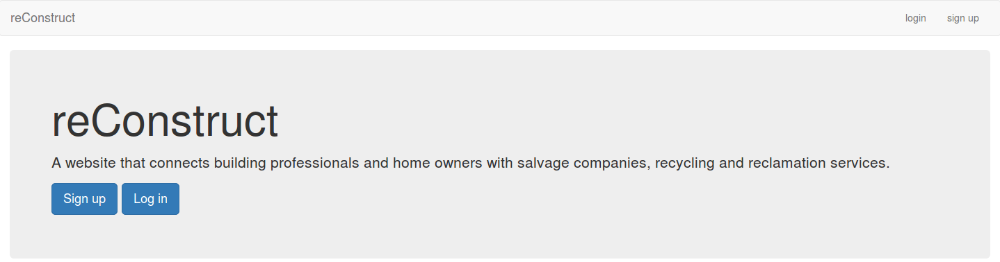
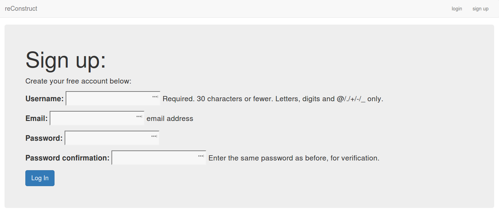
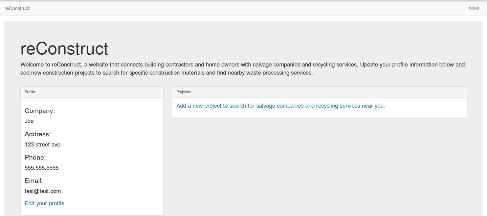
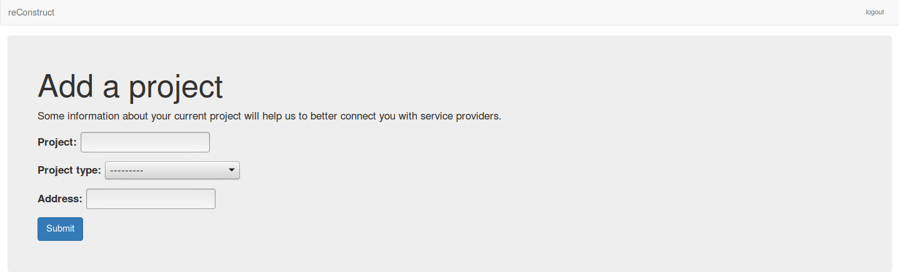
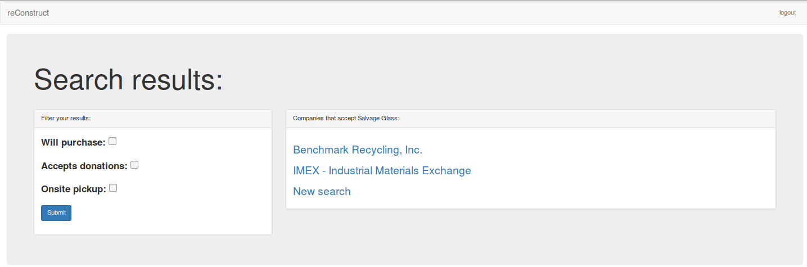
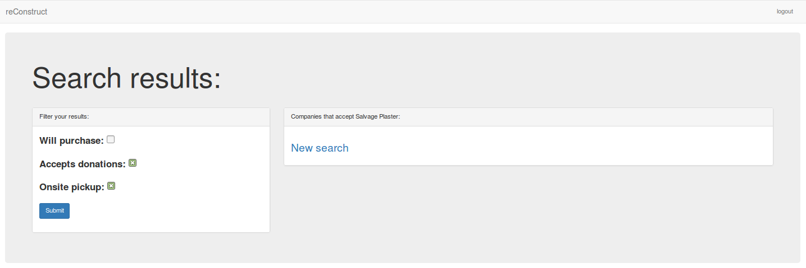
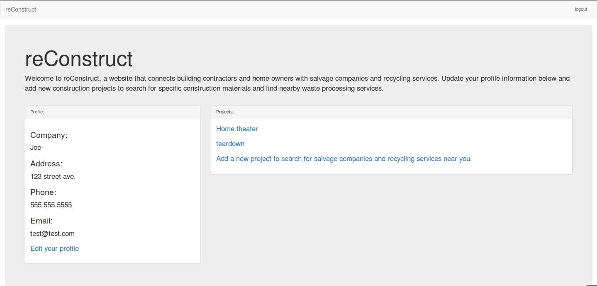
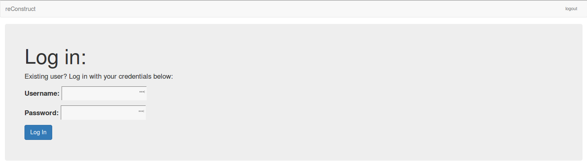

Documenting User Flow Through reConstruct
*****************************************

**Creating A User Account**
===========================

reConstruct main page:
----------------------

Click Sign Up to create a new user account.

Here, the user fills in the given fields with the appropriate information.  

.. figure:: images/reConstruct_profile_creation.png
   :align: center

Once the above has been entered, the user fills in profile details.

The user can now add projects.

Details of the project are added here.

.. figure:: images/reConstruct_material_search.png
   :align: center

Define the waste being generated to find local companies to handle it.

A local company dealing in plaster appears. 

Search results can be filtered through checking the lefthand boxes.  There appears to be no local company accepting plaster that both performs onsite pickups and accepts donations.  

After projects have been addded, they will appear 

**Logging In To An Existing Account**
=====================================

Existing users log in through the above screen.

After logging in, the user should see their profile page. 