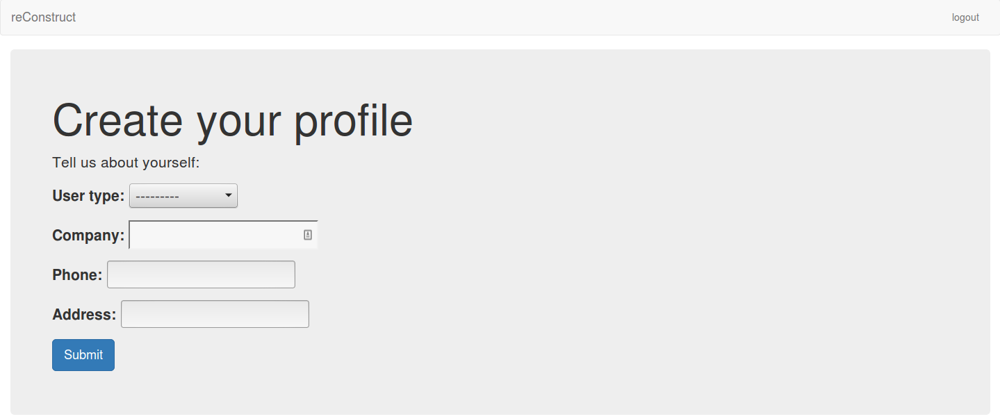

Documenting User Flow Through reConstruct
*****************************************

**Creating A User Account**
===========================

reConstruct main page:
----------------------

Click Sign Up to create a new user account.

.. figure:: images/reConstruct_Sign_up_page.png
   :align: center

Here, the user fills in the given fields with the appropriate information.  

Once the above has been entered, the user fills in profile details.

The user can now add projects.

.. figure:: images/reConstruct_add_project.png
   :align: center

**Logging In To An Existing Account**
=====================================

.. figure:: images/reConstruct_login_screen.png
   :align: center

Existing users log in through the above screen.

After logging in, the user should see their profile page. 