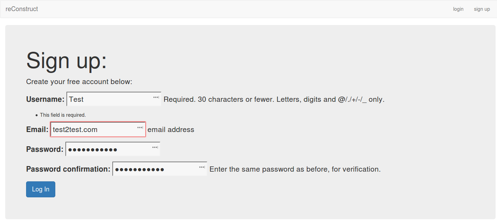

reConstruct User Documentation
==============================
The following documentation describes both the process of logging in as an 
existing user and signing up as a new user.

**Main Page**
-------------
The following image is the reConstruct front page.

**Sign Up**
-----------
The following image is the Sign up page.

On this page, the user enters the relevant information into the text fields 
to create their profile.  

Note how the log in page knows when entries are not entered correctly. 

**Create Your Profile**
-----------------------
The following image is the profile creation page.

.. figure:: images/Completed_profile.png
   :align: center

This is an example of a completed profile.

**Adding a Project**
--------------------
The following is an example of a user adding a new project.

When a new project is added, the user specifies what sort of material they
are getting rid of. 

When the above information is submitted, the user should see what local 
businesses take the given salvage material.  Options on the left side
of the screen allow the user to filter their search results.  If no results
match the filter creiteria, the user can uncheck the boxes or resubmit
the salvage materials that will come from their project.  

.. figure:: images/Salvage_search_results.png
   :align: center

**Logging in as an Existing User**
----------------------------------
The following is what an existing user should see when they attempt to log in.

.. figure:: images/Login_existing.png
   :align: center

After logging in they will be greeted by a page with their information and selected
projects.  

